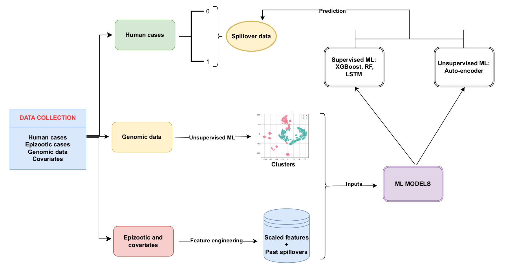

# Machine learning approaches to predict Yellow Fever Spillover Events

This project develops and evaluates various machine learning models to predict the risk of Yellow Fever (YF) spillover events in Brazilian municipalities. It integrates epidemiological records, environmental covariates (temperature, precipitation, population, species richness), and viral genomic data to identify key predictive factors and build robust forecasting tools.

## Table of Contents

-   [Project Overview](#project-overview)
-   [Features](#features)
-   [Repository Structure](#repository-structure)
-   [Data Sources](#data-sources)
-   [Setup Instructions](#setup-instructions)
-   [Running the Pipeline](#running-the-pipeline)

## Project Overview

Yellow Fever continues to pose a public health challenge in Brazil. Understanding and predicting spillover events—where the virus transmits from its wildlife reservoirs to human populations—is crucial for timely interventions. This project leverages machine learning to:
1.  Analyze historical YF human and epizootic (animal) cases.
2.  Incorporate environmental factors that influence vector and virus dynamics.
3.  Explore viral genomic data for potential host-specific signatures or risk markers.
4.  Train and evaluate supervised models (Random Forest, XGBoost, LSTM) and unsupervised/anomaly detection models (Autoencoder, VAE) for spillover risk prediction.

The steps for the scripts of this project is following the following workflow 
## Features

*   Comprehensive data integration from multiple sources.
*   Advanced feature engineering, including temporal lags, rolling averages, interaction terms, and spatial distance metrics.
*   Application of various machine learning techniques:
    *   Unsupervised clustering for genomic data (KMeans, DBSCAN, Gaussian Mixture, etc.).
    *   Supervised classification for spillover prediction (Random Forest, XGBoost, LSTM).
    *   Anomaly detection using Autoencoders and Variational Autoencoders.
*   Spatio-temporal visualizations of YF activity, environmental factors, and model predictions.
*   Modular Python scripts for reproducibility and extensibility.

## Repository Structure
```text
yellow-fever-spillover-prediction/
├── data/                  # To be created by user for raw data files
├── processed_data/        # Created by the scripts
├── results/
│   ├── figures/           # Output plots and maps (contains all the plots)
│   └── tables/            # Output performance metrics, etc. (created by the scripts)
├── trained_models/        # Saved model objects (created by the scripts)
├── src/                   # Python source code
│   ├── __init__.py
│   ├── S1_data_preparation.py
│   ├── S2_environmental_data.py
│   ├── S3_genomic_processing.py
│   ├── S4_feature_engineering.py
│   ├── S5_train_evaluate_supervised.py
│   ├── S6_train_evaluate_lstm.py
│   ├── S7_train_evaluate_autoencoders.py
│   ├── S8_visualizations.py
│   └── utils.py
├── README.md              # This file
└── requirements.txt       # Python package dependencies
```

## Data Sources

The primary datasets required for this project should be acquired from their respective official sources and placed in the `data/` directory (or subdirectories like `data/temperature/`, `data/rainfall/` as expected by the scripts).

1.  **Yellow Fever Human and Non-Human Primate (NHP) Cases (Epizootics):**
    *   **Source:** Brazilian Ministry of Health - DATASUS (opendatasus.saude.gov.br)
    *   **Link:** [https://opendatasus.saude.gov.br/en/dataset/febre-amarela-em-humanos-e-primatas-nao-humanos](https://opendatasus.saude.gov.br/en/dataset/febre-amarela-em-humanos-e-primatas-nao-humanos)
    *   **Expected files in `data/`:** `epizootic_cases.csv`, `number_case_data.csv` (or `human_cases.csv`).

2.  **Viral Genomic Sequences & Metadata:**
    *   **Source:** NCBI GenBank
    *   **Link (from paper):** [https://www.ncbi.nlm.nih.gov/](https://www.ncbi.nlm.nih.gov/)
    *   **Expected files in `data/`:** `sequences.xlsx` (metadata), `sequences.fasta` (sequence data).

3.  **Environmental Data:**
    *   **Mean Temperature (NetCDF):**
        *   **Source:** Climatic Research Unit (CRU) TS dataset.
        *   **Link (Copernicus, from paper):** [https://cds.climate.copernicus.eu/datasets](https://cds.climate.copernicus.eu/datasets)
        *   **Expected files in `data/temperature/`:** `.nc` files (e.g., `CRU_mean_temperature_mon_0.5x0.5_global_2000_v4.03.nc`).
    *   **Precipitation:**
        *   **Source Option 1 (Pre-processed CSV):** If you have a CSV.
        *   **Expected file in `data/`:** `precipitation.csv`.
        *   **Source Option 2 (TRMM HDF - raw):** NASA GES DISC.
        *   **Link (from paper):** [https://disc.gsfc.nasa.gov/datasets](https://disc.gsfc.nasa.gov/datasets)
        *   **Expected files in `data/rainfall/`:** `.HDF` files (e.g., `3B43.YYYYMMDD.7A.HDF`). The `data_acquisition/download_TRMM_rainfall.py` script may assist with this if properly configured with a `subset.txt` and Earthdata Login token.

4.  **Population Data:**
    *   **Historical (1970-2022):** IBGE, via Kaggle.
    *   **Link (Kaggle, from paper):** [https://www.kaggle.com/datasets/danielkomesu/population-of-brazilian-municipalities](https://www.kaggle.com/datasets/danielkomesu/population-of-brazilian-municipalities)
    *   **Expected file in `data/`:** `brazil_municipalities_population.csv`.
    *   **Recent Estimates (e.g., 2024):** IBGE.
    *   **Expected file in `data/`:** `po_2024.xlsx`.

5.  **Species Richness Data (Primates):**
    *   **Sources (from paper):** Kaul et al. (2018) and IUCN Red List.
    *   **Link (IUCN, from paper):** [https://www.iucnredlist.org/](https://www.iucnredlist.org/)
    *   **Expected file in `data/`:** `primate_richness.csv`.

6.  **Geospatial Data (Brazilian Municipalities):**
    *   **Source:** IBGE.
    *   **Expected files in `data/`:** Shapefile components (`BR_Municipios_2020.shp`, `.dbf`, `.shx`, etc.) and `municipalities_coordinates.csv`. The ADM1 level shapefile (`BRA_adm1.shp` etc.) is also used for some visualizations.

*Note: Please ensure filenames and paths match those expected by the scripts or update the configuration sections within each `.py` file.*


## Setup Instructions

1.  **Clone the repository:**
    ```bash
    git clone [URL_OF_YOUR_REPOSITORY]
    cd yellow-fever-spillover-prediction
    ```

2.  **Create and activate a Python virtual environment (recommended):**
    ```bash
    python3 -m venv venv
    source venv/bin/activate  # On Linux/macOS
    # venv\Scripts\activate    # On Windows
    ```

3.  **Install required Python packages:**
    ```bash
    pip install -r requirements.txt
    ```
    *(You will need to generate `requirements.txt` using `pip freeze > requirements.txt` in your activated environment after installing all necessary packages.)*

4.  **Acquire Data:** Download the necessary datasets from the sources listed above and place them into the `data/` directory (and its subdirectories like `data/temperature/`, `data/rainfall/` as needed).

## Running the Pipeline

The Python scripts in the `src/` directory are designed to be run sequentially. Each script processes data and typically saves its output to the `processed_data/` directory, which then serves as input for the next script.

Execute them from the project root directory (e.g., `yellow-fever-spillover-prediction/`):

```bash
python src/S1_data_preparation.py
python src/S2_environmental_data.py
python src/S3_genomic_processing.py
python src/S4_feature_engineering.py
python src/S5_train_evaluate_supervised.py
python src/S6_train_evaluate_lstm.py
python src/S7_train_evaluate_autoencoders.py
python src/S8_visualizations.py
